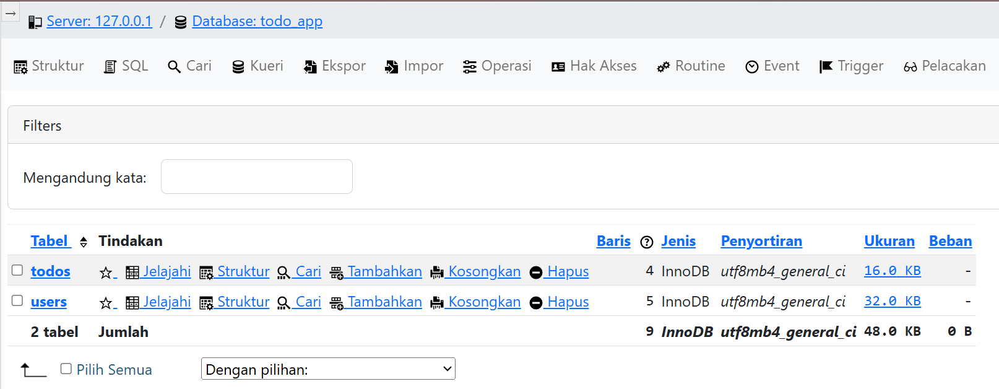
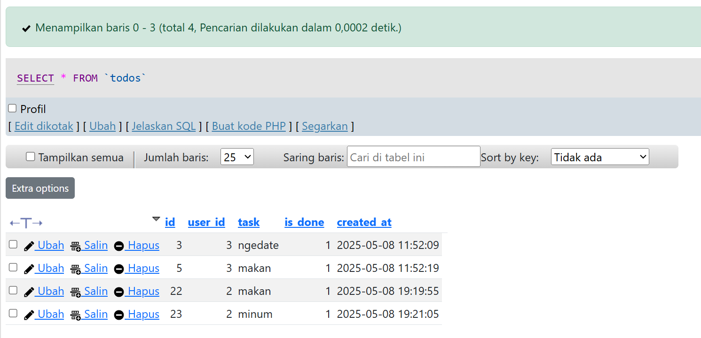
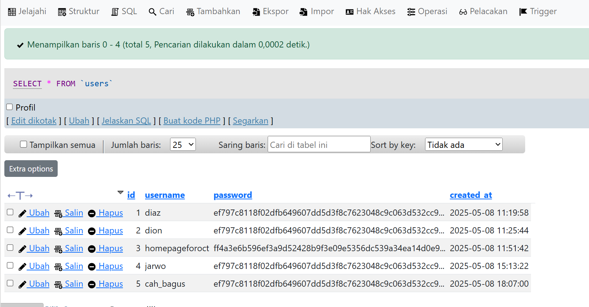
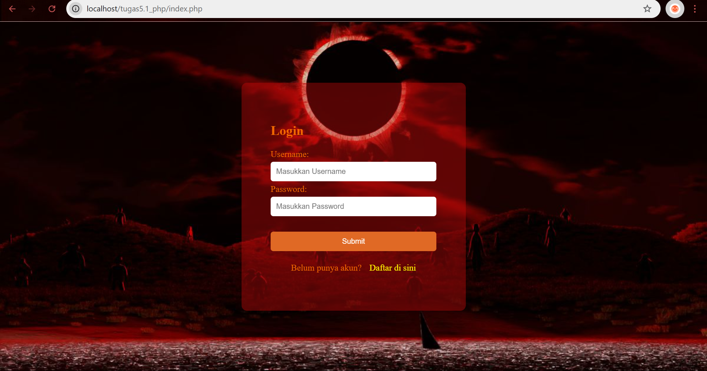
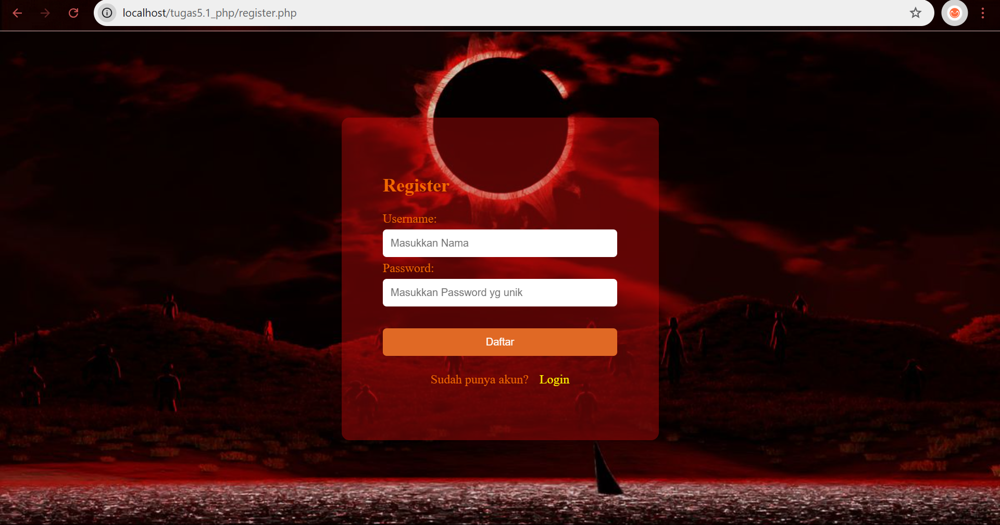
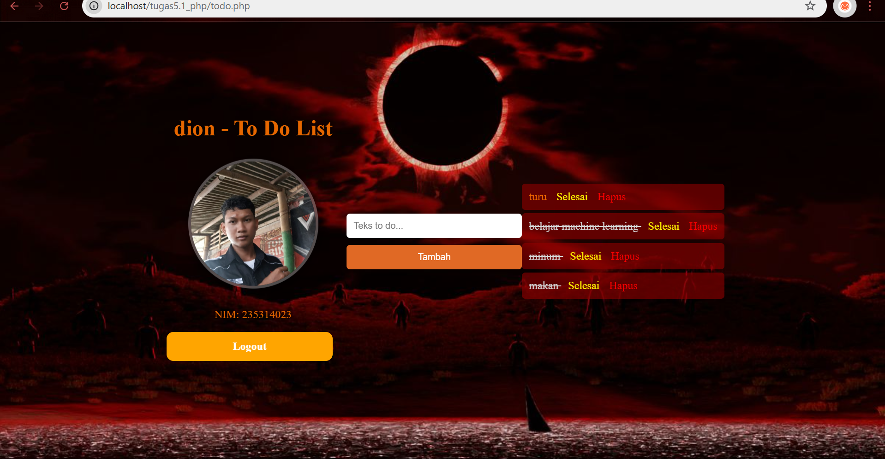
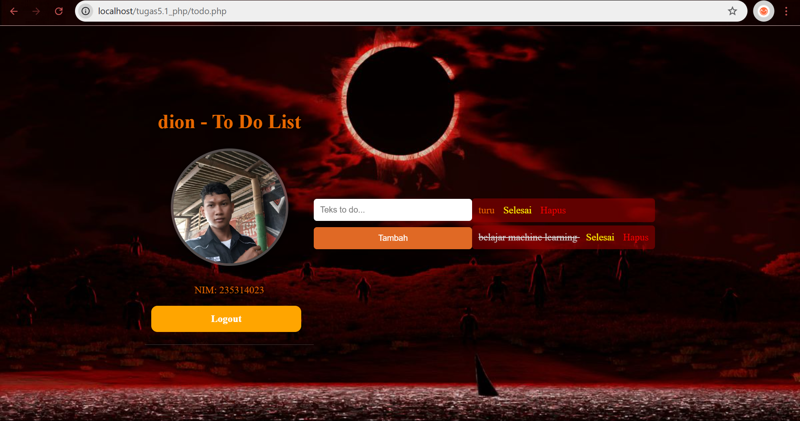
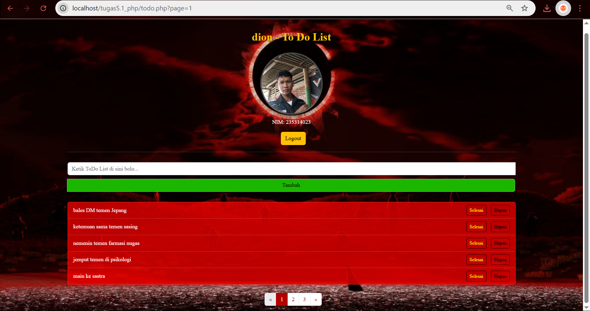
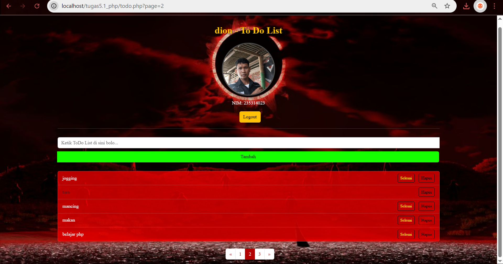

# Pemrograman Berbasis Platform by Dionysius Diaz

>>Screenshot tabel DB

>>Screenshot tabel ToDo

>>Screenshot tabel User

>>Screenshot Halaman Login

>>Screenshot Halaman Register/Pendaftaran

>>Screenshot Halaman ToDo

>>Screenshot Halaman ToDo(Setelah list dihapus)

>>Screenshot Halaman ToDo (Setelah penerapan template bootstrap (paginasi, penambahan tabel))

>>Screenshot Halaman ToDo (Jika list sudah melebihi 5 baris/row maka list pada baris paling bawah akan dipindah ke halaman berikutnya, list sebelumnya dapat diakses dengan menekan page number/next (>>) pada bar paginasi, dan untuk kembali ke halaman sebelumnya lakukan sebaliknya)

